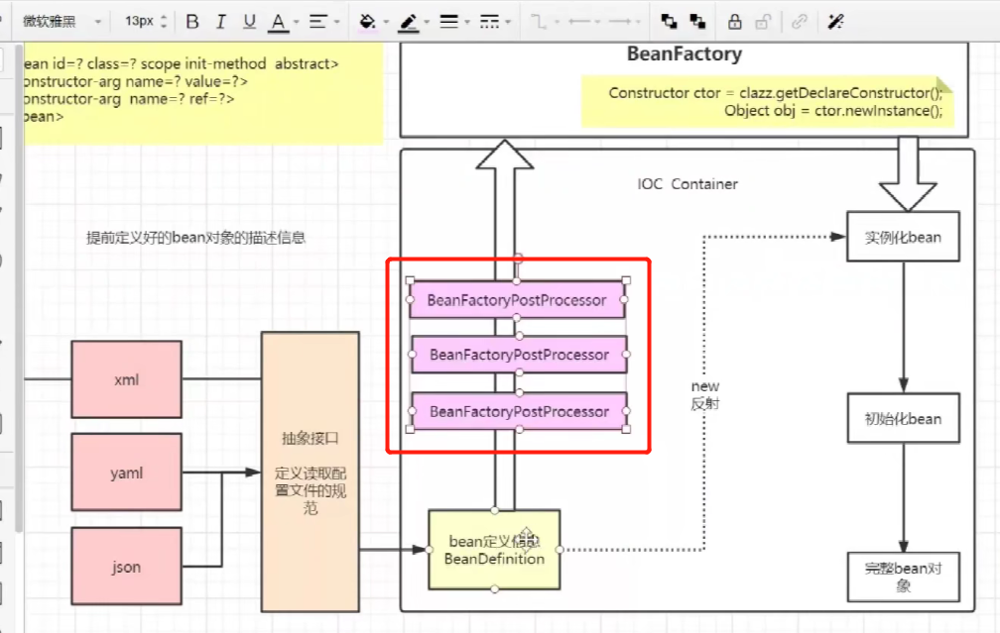
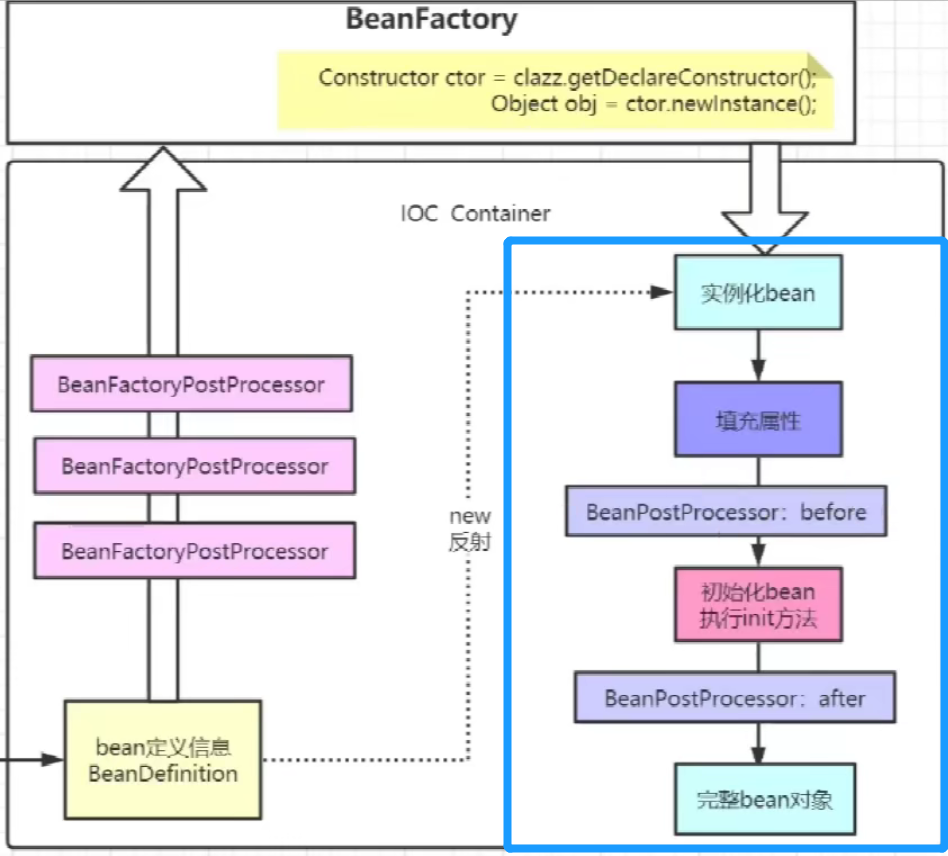
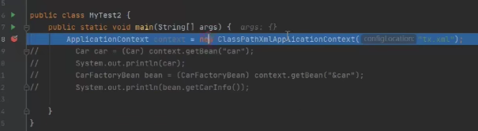
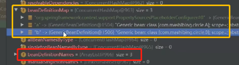

# Spring源码

## 1. IOC	

### IOC(控制反转)

#### 定义

原来我们使用java对象需要自己创建，但是现在是Spring容器帮我们创建，当我们需要的时候就从Spring的IOC容器内拿就可以了。

#### 数据结构

IOC容器本质上就是一个Map结构，Spring创建的所有对象都会按照<K, V>格式创建。我们可以通过Key来获得Spring创建的Bean实例对象。

### Spring创建对象的方式

创建对象的方式主要有3种：new一个新对象，工厂模式创建对象，使用反射创建对象。

##### 1. 读取配置文件  

在早期开发的时候，我们通过编辑xml配置文件，将对象的属性，是否单例，Bean的name的信息写在xml配置文件中作为要创建的Bean的定义信息。然后IOC容器有一个BeanDefinitionReader然后按照既定的规则去读取xml文件，并创建Bean的定义信息（在源码中定义出BeanDefinition对象）

- **BeanDefiition**: BeanDefinition是一个接口 描述一个bean实例，并拥有他的属性信息，构造方法的参数等信息用来创建Bean
- **BeanDefinitionReader**：BeanDefinitionReader也是一个接口，用来读取配置文件(例如：xml，json，priperties等)。每一种配置文件都拥有他对应的实现这个接口的对象用来读取对应的配置文件来创建BeanDefinition。如果我们使用xml配置文件 就指定一个xml文件的BeanDefinitionReader来读取配置文件

##### 2. 实例化

在获得了BeanDefinition之后 即我们获得了Bean的定义信息 我们就会根据这些BeanDefinition去实例化这些Bean对象。这个过程采用的是**反射**的方式创建，反射的过程是在**BeanFactory**中进行。

> 这里我们区分一下实例化和初始化：
>
> **实例化**：在堆中创建一个空间用于实例化对象，所有的属性都是默认值
>
> **初始化**：1. 给对象的属性赋值    2. 执行Bean的init方法

###### BeanFactory反射的过程

```java
// 获得BeanDefinition信息
BeanDefinition bd = beanFactory.getBeanDefinition("aa")

// 根据BeanDefinition的信息先获取Class对象
Class cls = Class.forName("com.mysql.jdbc.Driver"); // 报名+类名=完全限定名
Class cls = 对象.getClass();
Class cls = 类.class; // 这个要在上面import这个类

// 根据Class对象获得构造方法，并通过构造方法实例化对象
Construtor ctor = cls.getDeclareConstructor();
Object obj = ctor.newInstance();
```

##### 3. Bean的实例化信息的处理



- **BeanFacoryPostProcessor**: 这里的BeanFactoryPostProcessor可以对 BeanDefinition信息进行一个预处理。例如我们在xml配置文件中，如果有一些${jdbc.username}类似这种需要读取另一个yaml配置文件而获得的信息，就可以在这些BeanFactoryPostProcessor中进行一个BeanDefinition的预处理。

##### 4. 初始化



之后这一步就是初始化Bean，去给这些对象的属性赋值，然后完成Bean对象的创建。


##### 5. 额外的内容

- **StandardEnvironment**: 为了方便我们的使用，Spring在创建IOC容器的时候会将系统的相关属性加载到StandardEnvironment对象中，方便后续使用。
- **观察者模式**：如果我们需要监控Bean创建的过程 需要提前建立监听器和监听事件，这个就是观察者模式

## 2. 源码分析

### 1. Abstractapplication

我们Spring的启动类例如我们常用的ClassPathXmlApplicationContext都会继承Abstractapplication类，去继承他的refresh()方法，这个方法里有13个方法，就是初始化Spring的全部过程，下面我们会把13个方法一一介绍。



#### 1. prepareRefresh()

- 设置启动时间
- 更改Spring一些自带的状态标志位，active=true，closed=false
- 初始化环境变量StandardEnvironment
- 初始化一些Set集合

#### 2. obtainFreshBeanFactory()

- 判断是否有旧的BeanFactory，如果有就destroy，如果没有就createBeanFactory()
- customizeBeanFactory(beanFactory)： 个性化我们上一步创建的beanFactory()
- loadBeanDefinitions(beanFactory): 把配置文件里面的数据读取出来，然后BeanDefinitionReader把这些配置信息一个一个的读取出来然后封装成beanDefinition对象，然后加载到我们的beanFactory里面，具体实现是存放在beanDefinitionMap和beanDefinitionName里面。



#### 3. prepareBeanFactory(beanFactory)

- 我们刚才获得的beanFactory中很多属性都是null的，所以这一步是给beanFactory中的属性进行一个赋值操作。

#### 4. postProcessBeanFactory(beanFactory)


#### 5. invokeBeanFactoryPostProcessors(beanFactory)

- 实例化并调用所有注册的BeanFactoryPostProcessor

#### 6. registerBeanPostProcessor(beanFactory)


- 注册所有的BeanPostProcessor

#### 7. initMessageSource() [不重要]

- 进行国际化处理，用于语言的处理

#### 8. initApplicationEventMulticaster()

- 创建多播器 服务于 观察者模式所需要的监听事件

#### 9. onRefresh()


#### 10. registerListeners()

- 注册监听器

#### 11. finishBeanFactoryInitialization(beanFactory)

- **beanFactory.preInstantiateSingletons()**

  在 finishBeanFactoryInitialization这个方法中最重要的部分就是这里，**实例并初始化所有非懒加载的单例对象**。下面我们来介绍这个方法的步骤

  1. **obtainFreshBeanFactory()**：在上面的第二个方法中，我们读取了xml配置文件，然后获得了BeanDefinitionNames和BeanDefinitionMap两个变量。
  2. 在这个方法中我们会遍历整个BeanDefinitionNames这个List，然后当这个BeanDefinition不是懒加载，不是抽象且是单例的时候，他会先检测BeanFactory里面有没有这个实例化的Bean，如果没有就去使用createBean()去创建实例化这个Bean对象。
  3. **createBean()**：利用反射的方法去创建对象。获得构造器然后实例化对象。
  4. **populateBean()**：执行了populateBean方法 把属性和依赖都注入了  
  5. **initializeBean()**：这里面才进行了**Aware**相关方法，**afterPropertiesSet** 和 **initMethod** 方法的调用。同时在initMethod前后会遍历之前注册的BeanPostProcessor:Before和BeanPostProcessor:After。通过**addSingleton**方法将创建完的对象会被放进**三级缓存**中。当我们需要beanFactory.getBean的时候，运行doGetBean方法就会从三级缓存中根据beanName获得当前对象。

## Spring中的一些具体实现

### Autowired的自己实现

我们想要在UserController中注入一个UserService对象，平时我们采用的Autowired，这次我们用代码来进行实现Autowired

- 创建一个叫AutoWired的注解(不是我们常用的@Autowired), 这样就定义了一个AutoWired注解

```java
@Retention(RetentionPolicy.RUNTIME)
@Target(ElementType.FIELD) // 这个字段是放在field上面的
public @interface AutoWired{}
```

- 实现Autowired功能

```java
// 这是我们的controller对象
UserController user = new UserController();
Class<?extends UserController> clazz = userController.getClass();

// 获取创建controller对象所需要的全部属性名
Stream.of(clazz.getDeclaredFields()).forEach(field -> {
    String name = field.getName();
    // 检测这个field上面有没有AutoWired注解
    AutoWired annotation = field.getAnnotation(AutoWired.class);
    if(annotation != null){
        field.setAccessiable(true);
        // 获取属性的类型
        Class<?> type = field.getType();
        // 创建对象
        Object obj = type.newInstance();
        // 往controller对象里面set我们创建的userService 完成自动注入
        field.set(userController, obj);
    }
})
```

